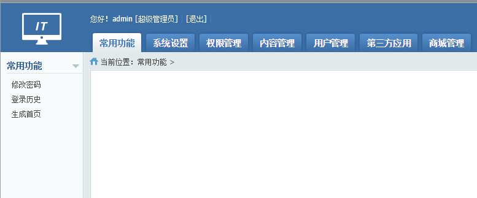
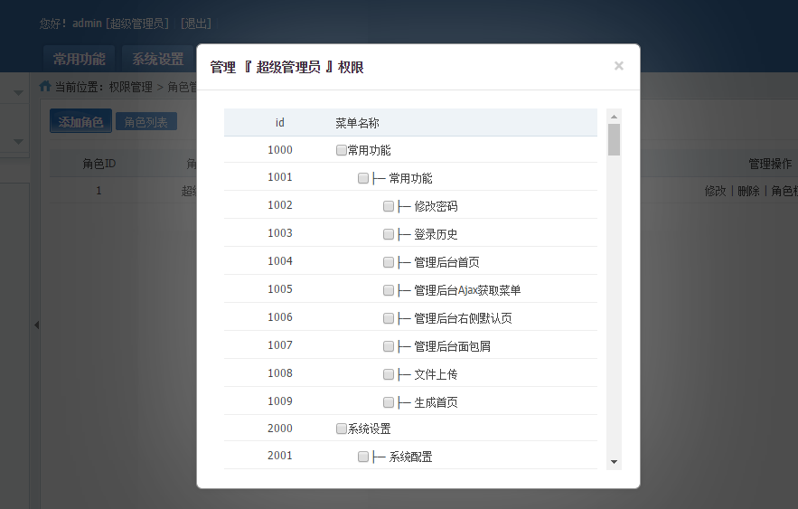
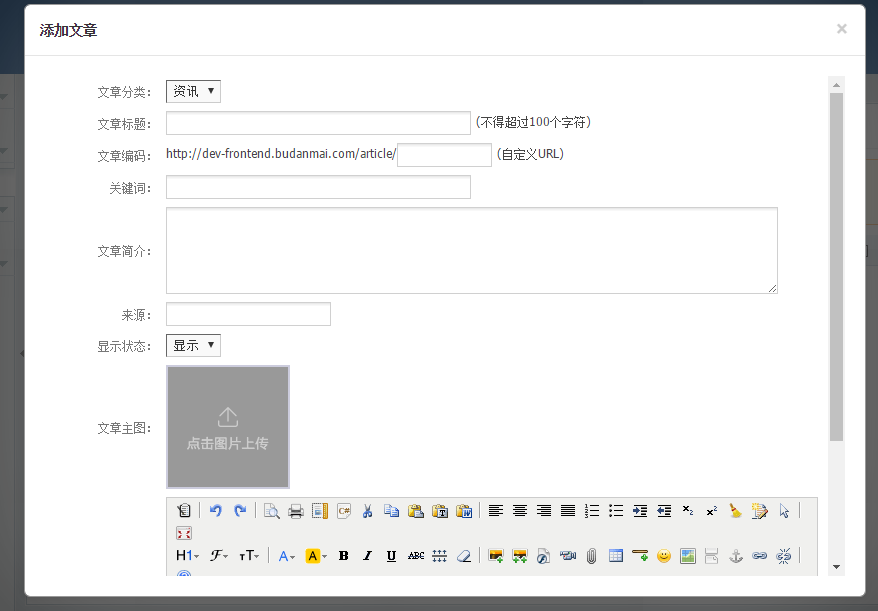
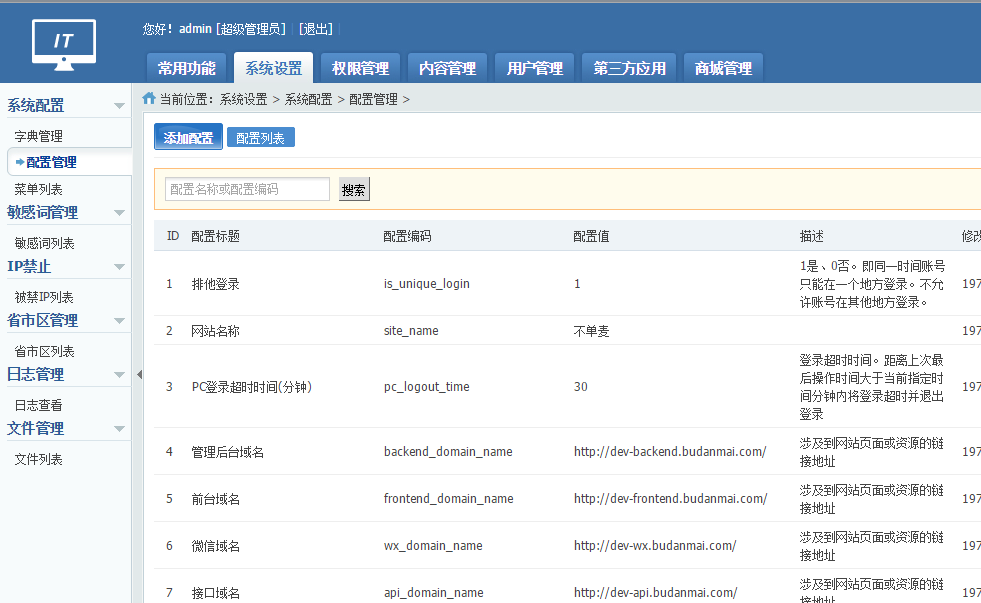
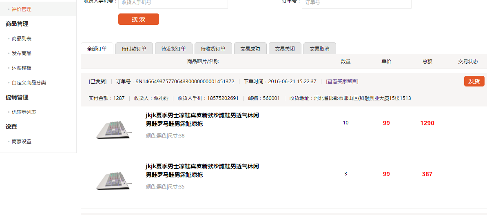
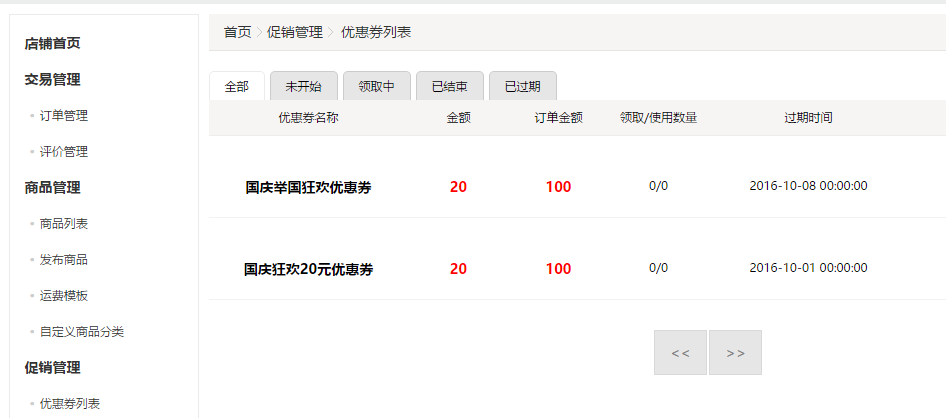
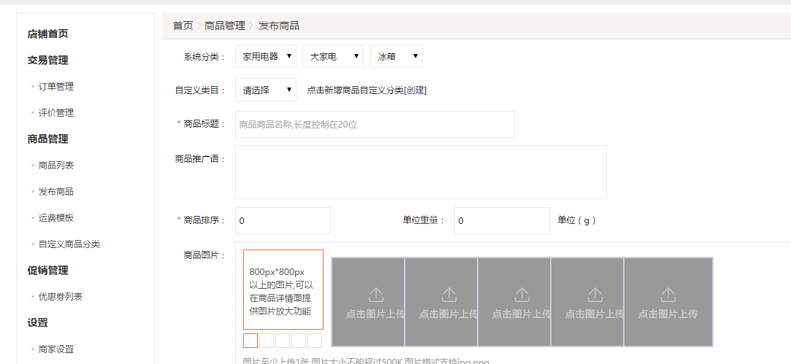

### YesnoPHP 框架安装指南###

[TOC]

2016年9月24号更新
最近时间充裕，就想着把这个项目完善一下。不然没事做。

2016年8月30号更新

1. 管理后台BUG大量修复。目前已经可以用于生产环境。
2. 完善完整的前台会员机制。
3. 其他各种小功能。

该版本有管理后台已经很完善。集成自己的功能进去也非常容易。前台会员登录验证机制非常完善。但是，由于本人时间有限，本来想把多商家商城做进去。结果只做了一半。加上没有前端模板以及自己前端技术太弱了。于是，只做了一半啊。大家自己很容易完善的。真的！

###该版本不再更新！但是，基于目前这个版本的所有问答我都###


###先更新文档，更新的代码还没有上传，大致差不多###

首先，我要感谢大家使用 YesnoPHP 框架。如果你在使用本框架过程中遇到什么问题可以通过 issues 提问。本人不对使用该源码带来的 BUG 或法律风险承担任何责任。你可以免费使用该源码到任何你想用的项目中。不用支付任何费用给本人。


YesnoPHP 使用了 PHPCMS v9 管理后台模板，部分功能设计参考了它的设计。所以，本项目只能作为学习使用。如果你要使用在项目中，请自行承担带来的法律风险。


YesnoPHP 框架是基于 PHP 的 Yaf 扩展开发的应用。简单的说，就是使用 Yaf 开发了一个网站。网站中涉及到的常用功能都已经实现了。一些不常用的功能，可以通过该项目源码自己增加。如果你对已经实现的功能不满意或不能满足自己的项目需求，也可以很容易地进行更改。


管理后台的功能如下：

1. 管理员模块。管理员增删改查。角色分配、角色的权限管理。

2. 配置管理。系统中使用到的配置都可以通过它来管理。并且使用了缓存加快配置的读取。

3. 字典管理。所谓字典就是那些比如银行列表、状态说明等数据。通过字典来进行管理。

4. 菜单管理。管理后台菜单管理。

5. 敏感词管理。可以通过设置敏感词之后，在想要使用的地方调用过滤用户输入。

6. 日志管理。系统中凡是PHP可以捕捉的错误或异常都可以拦截并记录到日志模块中供管理员查看。

7. 文件管理。查看或删除用户上传的文件。

8. 分类管理。广告分类、文章分类、商品分类。管理你想要管理的所有分类。

9. 文章管理。

10. 广告管理。广告位置、广告列表等数据管理。

11. 友情链接管理。设定友情链接分类，轻松维护你的友情链接。

12. 用户管理。轻松管理你网站的用户。增删改。

13. 多商家商城管理。这个是一个不成熟的设计。希望大家一起完善。


API模块：

已经实现了API的验证与数据调用。如果你想调用具体的数据，可以直接使用 yesnophp\library\services 中定义的方法。所有的业务都已经封装到了 services 中。大家可以根据需要自己实现具体的API接口。源码中已经提供了可用的示例。直接复制粘贴即可使用。


用户中心：

关于用户的操作全部都在 yesnophp\library\services 中。登录、注册、修改密码、权限判断都已经完整实现。还可以限制用户单点登录。即同一时间只能允许同一个人登录，多个用户登录会导致后登录的挤掉前面登录的人。当然，页面实现还没有做。


商家中心：

实现了一部分。大家帮忙一起完善。主干部分都已经实现了。就是没有人设计UI页面来套。一个人的力量是有限的。如果你有具体的页面模板，可以给我。我来写程序套上去。


前台：

这个需要自己去实现。反正数据库摆在那儿。该有的模块都有。所以，大家自己根据自己业务设计吧。


#### 一、准备工作####

1. PHP 版 5.6 或以上。原则上代码未使用特殊的语法特性以及不推荐的写法。所以，应该能运行在PHP5.4+。

2. 你得有一个 Redis 版本 3+ 以上的缓存服务器。它用来存储 session、数据缓存、队列等操作。

3. 你的 PHP 一定要安装PHP的 Yaf、Redis 扩展。这些两个PHP扩展都有 windows 和 Linux 版本。

Yaf 扩展下载地址：[http://pecl.php.net/package/yaf](http://pecl.php.net/package/yaf)

Redis 扩展下载地址：http://pecl.php.net/package/redis

*注意* ：Yaf 提供了 PHP5.x 与 PHP 7.x 两个版本的扩展，版本号 2+ 对应 PHP5.x，3+ 对应 PHP7.x。Redis扩展直接下载最新最稳定的那个版本就可以了。


#### 二、数据库####

在源代码目录 yesnophp\docs 以 .sql 结尾的文件，都是 YesnoPHP 框架用到的数据库文件。打开yesnophp.sql 文件，可以看到开头的几行：

````sql
DROP DATABASE IF EXISTS yesnophp;
CREATE DATABASE yesnophp DEFAULT CHARACTER SET utf8 COLLATE utf8_general_ci;
use yesnophp;
````

通过如上几行代码在数据库中通过命令行创建名为 yesnophp 的数据库。当然，你也可以通过其他可视货的 MySQL 客户端工具创建数据库。


然后，我们导入 yesnophp.sql 文件剩余的代码创建表与导入初始化数据。

再然后，我们导入 ms_district.sql 导入地区（省市区县街道）表。


#### 三、域名映射到不同的应用####

由于 YesnoPHP 框架在设计之初就是奔着开发中大型项目（有点吹牛嫌疑）设计的。所以，如下应用或功能模块被设计成各自一个域名访问。假设你有一个域名为 yesnophp.com

1. 账户中心：推荐的域名是 account.yesnophp.com

2. API接口：推荐的域名是api.yesnophp.com

3. 前台：推荐域名是 www.yesnophp.com 或 frontend.yesnophp.com

4. 管理后台：推荐域名是 backend.yesnophp.com 或 admin.yesnophp.com

5. 商家中心：推荐域名是 shop.yesnophp.com

6. 静态资源：推荐域名是 statics.yesnophp.com

7. 图片资源：推荐域名是files.yesnophp.com


*注意* ：商家中心是我增加在里面的一个多余模块。如果你在使用该源码的时候用不到可以直接删掉这个模块即可。


在 nginx 或 apache 中做域名映射的时候，应用映射到目录 yesnophp\sites 对应的应用上。通过名字可以很容易判断。


打开数据库中的 ms_config 表，把里面涉及到域名的地方都改成上面你自己定义的域名。


#### 四、配置####

配置文件 yesnophp\conf\application.ini。只需要修改里面的数据库与redis的信息即可。其中 authkey 配置很重要，很多地方都需要它。


通过如此几步，你现在可以运行 YesnoPHP 框架了。


部分截图：

















